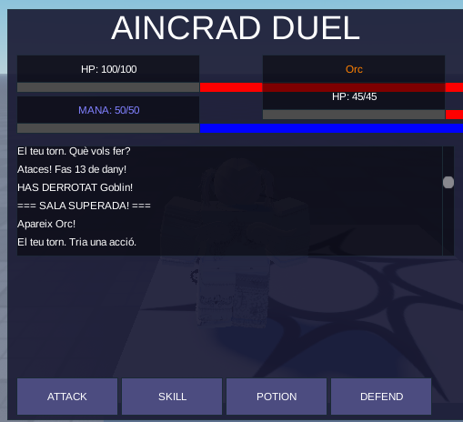

# Aincrad Duel

Microvideojoc de combat per torns desenvolupat a Roblox Studio (Luau).  
Inspirat en *Sword Art Online* — Projecte de l'assignatura **Entorns de Desenvolupament** (DAM1, curs 2025-26).

---

## Descripció

Un floor complet d'Aincrad amb **3 sales de combat** i un **Floor Boss final amb 2 fases**.  
El jugador gestiona HP, Mana i pocions per sobreviure fins al Boss. Combat per torns estrictes amb sistema de crítics i defensa dinàmica.

**Enemics:**
- Sala 1 — Goblin Scout (HP 30, ATK 8)
- Sala 2 — Orc Warrior (HP 45, ATK 12)
- Sala 3 — Stone Troll (HP 60, ATK 15)
- Boss — Kobold King (HP 120, ATK 18 → 27 en Fase 2)

---

## Captures de pantalla

| Estructura scripts | Combat actiu | Victòria |
|---|---|---|
|  |  |  |

---

## Tecnologies

| Eina | Ús |
|---|---|
| **Roblox Studio** | Motor de joc i IDE principal |
| **Luau** | Llenguatge de programació (superset de Lua 5.1) |
| **Rojo 7** | Sincronització fitxers VS Code ↔ Roblox Studio |
| **VS Code** | Editor de codi extern |
| **GitHub** | Control de versions i entrega |

---

## Com executar el projecte

### Requisits
- [Roblox Studio](https://www.roblox.com/create) (gratuït)
- [Rojo CLI](https://rojo.space/) (`rojo serve`)
- Plugin Rojo per a Roblox Studio

### Passos
```bash
# 1. Clona el repositori
git clone <url-del-repositori>
cd Aincrad-Duel/joc

# 2. Inicia el servidor Rojo
rojo serve
```

3. Obre Roblox Studio → crea un lloc nou buit  
4. Al plugin Rojo → **Connect** (`localhost:34872`)  
5. Prem **Play** a Studio per jugar

Vegeu [`docs/07_manual_tecnic.md`](docs/07_manual_tecnic.md) per a més detalls i resolució de problemes.

---

## Com jugar

| Acció | Botó | Efecte |
|---|---|---|
| Atacar | ⚔️ ATACAR | Fa dany bàsic a l'enemic (15% de crítics → ×1.5) |
| Habilitat especial | ✨ HABILITAT | Fa el doble de dany, costa 10 de Mana |
| Poció | 🧃 POCIÓ | Recupera 30 HP (màxim 3 pocions per partida) |
| Defensar | 🛡️ DEFENSAR | El proper atac enemic fa la meitat de dany |

- Supera les **3 sales** (Goblin Scout → Orc Warrior → Stone Troll) per arribar al **Boss**.
- El **Kobold King** entra en **Fase 2** al 50% de vida: ATK augmentat i atacs especials amb cremada 🔥.
- Al derrotar cada enemic recuperes 20 HP i 10 Mana.

---

## Estructura del repositori

```
Aincrad-Duel/
├── README.md
├── ia_log.md                        # Registre d'ús d'IA
├── docs/
│   ├── 01_idea_i_abast.md
│   ├── 02_model_del_joc.md
│   ├── 03_entorn_i_prototip.md
│   ├── 04_proves_i_depuracio.md
│   ├── 05_millores_i_reflexio_final.md
│   ├── 06_manual_usuari.md
│   └── 07_manual_tecnic.md
├── diagrames/
│   ├── diagrama_classes.svg
│   └── diagrama_comportament.svg
├── evidencies/                      # Evidències del procés de desenvolupament
│   ├── captures/
│   ├── gameplay/
│   ├── proves/
│   ├── errors/
│   ├── commits/
│   └── ia/
├── tests/
│   └── casos_prova.md
└── joc/                             # Projecte Rojo (codi font)
    ├── default.project.json
    └── src/
        ├── server/CombatManager/    # Lògica de joc (servidor)
        ├── client/                  # Scripts de client
        ├── gui/                     # GUI de combat
        └── assets/EnemyTemplates/   # Models 3D (.rbxm)
```

---

## Arquitectura

```
[Client - UIController.client.luau]
        ↕ CombatAction (accions jugador → servidor)
        ↕ UIUpdate     (stats i events → client)
[Servidor - CombatManager/init.server.luau]
    ├── CharacterStats (base)
    ├── PlayerStats    (jugador)
    ├── Enemy          (NPC)
    └── Boss           (boss 2 fases)
```

La lògica de combat és **100% server-side** per seguretat. El client envia accions i rep notificacions d'estat.

---

## Estat del projecte

✅ **Versió final funcional** — totes les fases de desenvolupament completades.

| Fase | Estat |
|---|---|
| Idea i abast | ✅ Completada |
| Model i diagrames | ✅ Completada |
| Entorn i prototip | ✅ Completada |
| Proves i depuració | ✅ Completada |
| Millores i reflexió | ✅ Completada |
| Documentació final | ✅ Completada |

---

## Enllaç al vídeo de gameplay

🎮 [Veure vídeo de gameplay comentat](https://AFEGIR-ENLLAÇ-AQUI)

> Vídeo de mínim 4 minuts on es mostra el funcionament complet del joc i s'expliquen les decisions de disseny.

---

## Autor

**Paula Romero García** — DAM1, Entorns de Desenvolupament, curs 2025-26

---

## Reflexió breu

Aquest projecte m'ha ensenyat a pensar com a desenvolupadora de manera estructurada: primer analitzar el problema, depois modelar la solució amb diagrames, i només llavors programar. La part més difícil ha estat la configuració de l'entorn Rojo i la depuració de bugs de lògica (especialment el sistema de defensa). He après que les proves no són opcionals: sense elles, errors com el reset de `isDefending` haurien passat desapercebuts. L'ús de la IA m'ha ajudat a explorar opcions i desbloquejar problemes, però he hagut de validar cada resposta contra el codi real, cosa que ha reforçat la meva comprensió del projecte.
