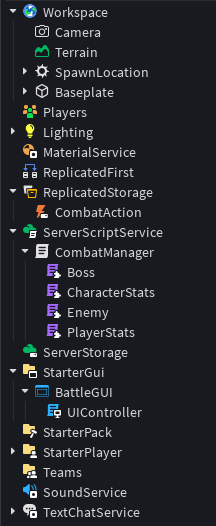
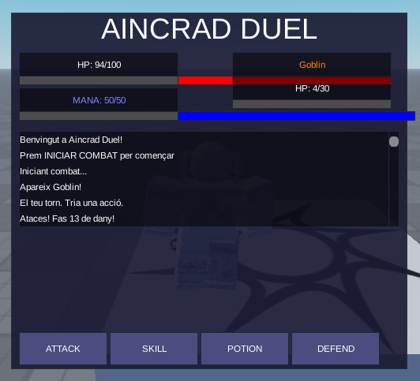

# 03 — Entorn i prototip funcional

## IDE utilitzat
**Roblox Studio** - Entorn integrat per desenvolupar jocs amb Lua

## Configuració bàsica

L'estructura de scripts del projecte és la següent:
ServerScriptService
└── CombatManager (Script)
├── CharacterStats (ModuleScript)
├── PlayerStats (ModuleScript)
├── Enemy (ModuleScript)
└── Boss (ModuleScript)

ReplicatedStorage
└── CombatAction (RemoteEvent)

StarterGui
└── BattleGUI (ScreenGui)
└── UIController (LocalScript)

## Decisions inicials d'implementació

1. **Arquitectura client-servidor**: Tota la lògica de combat s'executa al servidor (CombatManager). La interfície d'usuari s'executa al client (UIController). La comunicació es fa mitjançant RemoteEvents.

2. **Sistema de mòduls**: S'han creat 4 ModuleScripts dins del CombatManager per estructurar el codi:
   - `CharacterStats`: Classe base amb HP, ATK, DEF i mètodes comuns
   - `PlayerStats`: Hereta de CharacterStats, afegeix Mana i pocions
   - `Enemy`: Hereta de CharacterStats, inclou IA senzilla
   - `Boss`: Hereta de Enemy, afegeix sistema de 2 fases

3. **Interfície creada per codi**: Tots els elements de la GUI (botons, barres, text) es generen des del LocalScript per evitar errors de disseny manual.

4. **Màquina d'estats**: El combat es controla amb una variable `combatState` que pot ser IDLE, PLAYER_TURN, ENEMY_TURN, ROOM_CLEAR, GAME_OVER o VICTORY.

## Captures de pantalla

### Estructura dels scripts a l'Explorador de Roblox Studio

### Interfície de combat en execució

### Missatge de victòria

## Estat actual del prototip

| Funcionalitat | Estat |
|---|---|
| Combat per torns | ✅ Implementat |
| Botó ATACAR | ✅ Funcional |
| Botó HABILITAT ESPECIAL | ✅ Funcional (gasta Mana) |
| Botó POCIÓ | ✅ Funcional (recupera HP) |
| Botó DEFENSAR | ✅ Implementat (estructural) |
| Transició entre sales | ✅ Funcional |
| Enemic resposta automàtica | ✅ Funcional |
| Sistema de HP i Mana | ✅ Funcional |
| Victòria | ✅ Detecta quan enemic mor |
| Derrota | ✅ Detecta quan jugador mor |
| Boss amb 2 fases | ✅ Implementat (canvia ATK al 50% HP) |

## Problemes detectats (pendents per Fase 4)

- La defensa redueix dany però no està completament polida
- No hi ha sistema de crítics (es va descartar per simplificar)
- La interfície és funcional però poc estètica